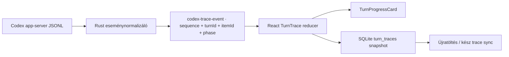

# Live Codex munkafolyamat GUI – implementációs terv

Állapot: implementálva és stabilizálva  
Dátum: 2026-07-16  
Érintett rétegek: Tauri/Rust app-server adapter, React kliens, lokális SQLite store, sync

## Implementációs állapot

A live GUI-frissítés első működő köre elkészült:

- a Rust adapter részletes reasoning summaryt kér, tartós plan-instructiont ad a threadnek, fázis- és sorrend-információval továbbítja az agent message delta eseményeket, valamint külön transport-státuszokat küld;
- a React kliens azonnali fallback tervet és élő `TurnProgressCard`-ot jelenít meg, a Codex plan lépéseit és a commentary/reasoning summary ciklusokat lépésenként rendezi, a végső választ pedig külön tartja;
- az ikon-aktivitás, auto-scroll, 8 másodperces watchdog és a completion/input hangjelzés a live állapotot követi;
- a terv- és commentary-előzmény threadenként a WebView localStorage-éba kerül, a meglévő work itemek továbbra is a lokális SQLite snapshotban maradnak.

A `turn_traces` külön SQLite/sync aggregate még nincs bekötve ebben az MVP-ben; ezért a terv- és commentary-trace ugyanazon a gépen/threadben marad meg, de a v2 OneDrive journal nem szinkronizálja külön ezeket a mezőket. A jelenlegi vizuális és live működés ettől függetlenül használható.

## 1. Célállapot

A felhasználó az elküldés pillanatától folyamatosan lássa, hogy a kérés hol tart. Minden turn kapjon legalább egylépéses feladattervet, a lépésekhez legyenek hozzárendelve a Codex által ténylegesen streamelt gondolkodási összefoglalók és munkafázisok, az ikon-sáv pedig élőben kövesse a parancsokat, fájlműveleteket és eszközhívásokat.

A végső válasz után a munkamenet ne lapuljon egy összesített naplóvá: a felhasználó továbbra is kiválaszthassa a lépést, azon belül a gondolkodási ciklust, majd annak részleteit.

## 2. A jelenlegi késés és zsúfoltság konkrét okai

Az aktuális implementációban már érkeznek használható app-server események, de a feldolgozásuk elveszít fontos összefüggéseket:

- A Rust adapter minden `item/agentMessage/delta` eseményt egyetlen szövegfolyamba fűz. Az assistant üzenet `commentary` vagy `final_answer` fázisa nem jut el a React állapotig, ezért az élő státuszok és a végső válasz összemosódnak.
- A `CodexDelta` nem tartalmaz `turnId`-t, fázist vagy stabil eseménysorszámot.
- A frontend a plan, a munkafolyamat és a live részeredmény adatait három külön állapotban és három külön kártyában tartja. Nincs explicit `lépés -> gondolkodási ciklus -> aktivitás` kapcsolat.
- A plan csak az aktuális thread utolsó snapshotjaként él; nem turnönként tárolódik. Újratöltés után a korábbi turnök lépései és ciklusai nem böngészhetők megbízhatóan.
- A befejezéskor a `response.events` eseményeket a kliens újrajátssza akkor is, ha azok live már megérkeztek. Ez delta-duplikációt és összezsúfolt tartalmat okozhat.
- Az auto-scroll effekt csak a `messages` és `isStreaming` változását figyeli, a plan/reasoning/activity frissítéseket nem.
- A lokális fájlkontextus legfeljebb négy fájlt egymás után, fájlonként 3 másodperces timeouttal próbál olvasni. A legrosszabb előkészítési idő így körülbelül 12 másodperc, miközben nincs részletes transport-státusz.
- A Rust réteg kérésenként új app-server folyamatot indít és inicializál. Ezalatt a GUI csak általános töltést mutat.
- A `turn/start` jelenleg nem kér explicit részletes reasoning summaryt, így a reasoning események mennyisége modell- és konfigurációfüggő.

## 3. Fontos tartalmi határ

A GUI-ban megjelenő „Gondolkodás” a Codex app-server által felhasználói megjelenítésre ténylegesen átadott alábbi tartalmakat jelenti:

- `item/reasoning/summaryTextDelta` gondolkodási összefoglalók;
- `item/reasoning/summaryPartAdded` összefoglaló-részek;
- `phase: "commentary"` interim assistant státuszok;
- tool-, command-, file- és approval-események tényszerű állapotai.

A kliens nem rekonstruál és nem talál ki rejtett chain-of-thought tartalmat. Az `item/reasoning/textDelta` nyers reasoning csatorna nem kerül felhasználói megjelenítésre. A felületi cím ezért **„Gondolkodás · Codex-összefoglalók”** lesz, rövid tooltip magyarázattal.

## 4. Új UX

Minden user turn egyetlen `TurnProgressCard` komponenst kap. Ez váltja ki a külön `PlanProgressCard`, `LiveResponseCard` és `CompactWorkFlowCard` kártyákat.

```text
┌ Codex dolgozik · 00:18 · Fájlok vizsgálata                         ● LIVE ┐
│ LÉPÉSEK   [1 Értelmezés ✓] [2 Adatfolyam javítása ›] [3 Tesztelés]       │
│                                                                          │
│ GONDOLKODÁSI CIKLUSOK        KIVÁLASZTOTT CIKLUS                         │
│ [1 Követelmények ✓]          „A stream eseményeit turn szerint…”         │
│ [2 Event mapping  ●]         [a szöveg ide érkezik folyamatosan]         │
│ [3 Ellenőrzés]                                                           │
│                                                                          │
│ AKTIVITÁS  ◌ ── ›_ ── □ ── ◇ ── ●                                      │
└──────────────────────────────────────────────────────────────────────────┘
```

### 4.1 Azonnali állapot

Az elküldés után legfeljebb egy render-cikluson belül létrejön a kártya, még a lokális kontextus beolvasása és az app-server indítása előtt:

- fejléc: `Kérés fogadva · feladat értelmezése`;
- ideiglenes plan: egy `Feladat értelmezése és végrehajtása` lépés, `clientFallback` forrással;
- live időmérő és pulzáló állapotjelző;
- üres ciklushelyett tényszerű szöveg: `Várakozás az első Codex-összefoglalóra…`.

Ez nem modellnek tulajdonított gondolkodás, hanem kliensállapot. Amint valódi plan érkezik, a fallback lépést a reducer összeegyezteti a modell lépéseivel.

### 4.2 Lépések

- A lépésválasztó minden turnnél megjelenik, egylépéses feladatnál is.
- A lépések állapota élő: `pending`, `inProgress`, `completed`, kliensoldali `error` és `cancelled` kiegészítéssel.
- A felhasználó bármelyik lépésre kattinthat. Befejezett turnnél a választás stabilan megmarad.
- Live módban az aktív lépést automatikusan követjük addig, amíg a felhasználó kézzel nem választ régebbi lépést. Ilyenkor nem rántjuk el a nézetet; egy `új aktivitás` jelvény mutatja az új eseményt.

### 4.3 Gondolkodási ciklusok

- Egy külön reasoning `itemId` egy gondolkodási ciklus.
- A `summaryIndex` alapján ugyanazon ciklus több összefoglaló-része külön megmarad.
- A ciklus ahhoz a planlépéshez tartozik, amely az `item/started` pillanatában aktív volt.
- A lépés kiválasztása leszűri a cikluslistát; a ciklus kiválasztása megnyitja annak streamelt összefoglalóját, commentary státuszait és kapcsolódó aktivitásait.
- Ha a modell egyáltalán nem küld reasoning summaryt, a panel ezt írja ki: `Ehhez a lépéshez nem érkezett Codex-összefoglaló.` Commentary és tool-státusz ettől még látható marad.

### 4.4 Live ikon-sáv

Az ikon-sáv a kiválasztott lépéshez/ciklushoz tartozó aktivitásokat mutatja eseménysorrendben:

| Ikon | Típus | Live állapot |
|---|---|---|
| `◌` | reasoning summary | pulzál, amíg delta érkezik |
| `›_` | command/process | running -> exit code szerinti kész/hiba |
| `□` | file change | started -> patch frissül -> completed |
| `◇` | MCP/dynamic tool/web search | started -> progress -> completed |
| `?` | approval/input | várakozik, amíg a user nem dönt |
| `●` | commentary/finalizálás | érkezik -> kész |

Minden ellenőrizhető ikon kattintható. A részletnézetben parancs, fájlútvonal, rövidített output/diff és hiba jelenhet meg. Nagy output nem teríti szét a kártyát; külön scrollozható részletnézetet kap.

### 4.5 Végső válasz

- A végső assistant válasz a `TurnProgressCard` alatt jelenik meg hagyományos chatüzenetként.
- Csak `phase: "final_answer"` kerül a végső message-be.
- A commentary és reasoning summary a trace-ben marad, nem kerül bele a végső szövegbe.
- Ha egy provider `phase: null` értéket küld, az item élőben `fázis ismeretlen` jelzéssel a trace-ben látszik. `turn/completed` eseménynél az utolsó nem üres, ismeretlen fázisú agent message lesz a final kompatibilitási jelölt; a korábbiak commentaryként maradnak meg.
- A progress kártya befejezés után összecsukható, de alapértelmezés szerint a kiválasztott lépés/ciklus látható marad.

## 5. Adatfolyam



A frontend többé nem külön `codex-delta` és `codex-event` csatornákból próbálja ugyanazt az állapotot összeépíteni. A Rust egy normalizált, sorszámozott `codex-trace-event` csatornát ad a GUI-nak. A nyers `codex-event` ideiglenesen megtartható debug/kompatibilitási célra, de nem hajthatja a megjelenítést.

## 6. Kliensoldali adatmodell

Javasolt, verziózott aggregate:

```ts
type TurnTrace = {
  schemaVersion: 1;
  requestId: string;
  threadId: string | null;
  turnId: string | null;
  status: "preparing" | "running" | "waitingForUser" | "completed" | "error" | "cancelled";
  transportStage: string;
  plan: TraceStep[];
  cycles: ReasoningCycle[];
  activities: TraceActivity[];
  commentary: CommentaryEntry[];
  finalMessageItemId: string | null;
  startedAt: number;
  updatedAt: number;
  completedAt: number | null;
  lastSequence: number;
};

type TraceStep = {
  id: string;                 // lokális stabil id; a protokoll nem ad step id-t
  text: string;
  ordinal: number;
  status: "pending" | "inProgress" | "completed" | "error" | "cancelled";
  source: "clientFallback" | "codexPlan";
};

type ReasoningCycle = {
  id: string;
  itemId: string;
  stepId: string;
  ordinal: number;
  status: "running" | "completed" | "error" | "cancelled";
  summaryParts: string[];
  commentaryIds: string[];
  startedAt: number;
  completedAt: number | null;
};

type TraceActivity = {
  id: string;
  itemId: string | null;
  stepId: string;
  cycleId: string | null;
  kind: "reasoning" | "command" | "file" | "tool" | "approval" | "status";
  status: "running" | "completed" | "error" | "cancelled";
  label: string;
  detail?: string;
  output?: string;
  sequence: number;
};
```

A planlépésekhez az app-server nem ad azonosítót. A reducer a frissített plan szövegét normalizálva, sorrendtartó egyeztetéssel tartja stabilan a lokális `step.id` értékeket. A már hozzárendelt ciklusokat utólagos plan-átírás sem mozgathatja másik lépéshez.

## 7. App-server eseménytérkép

| Bejövő esemény | Reducer művelet |
|---|---|
| kliens `requestAccepted` | fallback turn és egylépéses plan azonnali létrehozása |
| Rust `transport/*` | fejléc tényszerű státuszának frissítése |
| `turn/started` | valódi `turnId`, `running` állapot |
| `turn/plan/updated` | lépések stabil reconcile-ja és státuszfrissítése |
| `item/plan/delta` | csak ideiglenes plan preview; completed snapshot felülírja |
| reasoning `item/started` | új ciklus az aktuális lépés alatt |
| `item/reasoning/summaryPartAdded` | `summaryParts[summaryIndex]` inicializálása |
| `item/reasoning/summaryTextDelta` | delta hozzáfűzése a megfelelő ciklus/rész végéhez |
| agentMessage `item/started` | `itemId -> phase` kapcsolat eltárolása |
| `item/agentMessage/delta`, commentary | commentary entry live bővítése |
| `item/agentMessage/delta`, final_answer | kizárólag a live végső message bővítése |
| `item/agentMessage/delta`, phase null | látható kompatibilitási buffer; turn végén final/commentary besorolás |
| command/file/tool `item/started` | live ikon létrehozása az aktuális lépés/ciklus alatt |
| output/progress/patch delta | a kapcsolódó ikon részletének bővítése |
| `item/completed` | ciklus vagy aktivitás lezárása |
| approval/input request | turn `waitingForUser`, `notify.wav`, döntés után folytatás |
| `turn/completed` | aktív fallbackek lezárása, snapshot mentése, `tada.wav` |
| error/cancel | aktív elemek hibás/megszakított lezárása |
| `item/reasoning/textDelta` | nem jelenítjük meg |

Minden esemény kap Rust oldali monoton `sequence` értéket. A reducer a `(turnId, sequence)` kulcsot deduplikálja, ezért a live csatorna és az esetleges recovery replay nem duplázhat szöveget.

## 8. A Codex viselkedésének beállítása

### 8.1 Részletes reasoning summary

A `turn/start.params` kapja meg:

```json
{ "summary": "detailed" }
```

Ez növeli annak esélyét, hogy folyamatos, felhasználónak szánt reasoning summary események érkezzenek. Ha egy modell ezt nem támogatja vagy nem küldi, a GUI a commentary/tool eseményekkel és a tényszerű fallback állapottal működik tovább.

### 8.2 Mindig legyen plan, de a feladat is fusson le

A thread start/resume `developerInstructions` mezője kapjon rövid, tartós szabályt:

```text
For every user task, create and maintain an execution plan with at least one step.
Update it when work moves between steps, including for simple one-step tasks.
Then execute the plan in the same turn. Before long tool work, emit concise
user-facing progress commentary. Do not reveal private chain-of-thought.
```

Nem használjuk a `collaborationMode: "plan"` módot, mert az tervezési válasznál megállhat. A turn normál/default módban marad, így a plan és a végrehajtás ugyanabban a kérésben történik.

## 9. 10–15 másodperces visszajelzési garancia

A GUI nem garantálhatja, hogy maga a modell 15 másodpercen belül küld summaryt, de azt garantálhatja, hogy a felület nem marad néma:

1. **0–100 ms:** kliensoldali `Kérés fogadva` és fallback lépés.
2. **Transport közben:** a Rust adapter eseményt küld az `app-server indítása`, `inicializálás`, `thread folytatása/indítása`, `turn indítása` állapotokról.
3. **8 másodperc modell-esemény nélkül:** `A Codex dolgozik; még nem érkezett megjeleníthető összefoglaló.` Ez watchdog-státusz, nem kitalált gondolat.
4. **15 másodperc után:** elapsed time és utolsó ismert transport/modell állapot marad látható; nincs ismétlődő, hamis „gondolkodás”.
5. **Valódi delta esetén:** legfeljebb 50 ms-os `requestAnimationFrame`/buffer batch után megjelenik.

A lokális fájlkontextus olvasását párhuzamosítani kell egyetlen, globális 3 másodperces határidővel. Ettől a legrosszabb előkészítés körülbelül 12 másodpercről körülbelül 3 másodpercre csökken.

A kérésenkénti app-server spawn lecserélése tartós `AppServerSession` kapcsolatra külön teljesítmény-optimalizációs lépés. A GUI és az eseménymodell elkészülte után érdemes bevezetni, mert a cancel/approval és több thread eseményroutingját is át kell alakítani. A funkcionális live megjelenítés nem függ ettől.

## 10. Scroll, kiválasztás és renderelési szabályok

- A trace revíziója is triggereli az auto-scrollt.
- Automatikus scroll csak akkor történik, ha a user legfeljebb 72 px-re van az aljától.
- Régi lépés/ciklus kézi megnyitása kikapcsolja az automatikus belső kiválasztáskövetést, de nem állítja le a streamet.
- A deltaszöveget memóriában teljesen megőrizzük; rendereléskor legfeljebb 50 ms-os batch engedett.
- Ciklusonként és aktivitásonként méretkorlát szükséges a nagy parancskimenetekhez. A levágás jelölt legyen, ne csendes.
- `aria-live="polite"` csak a fejléc rövid státuszát jelentse be; minden delta felolvasása használhatatlanná tenné a felületet.
- Mobil/szűk nézetben a cikluslista és a részletnézet egymás alá törik, az ikon-sáv vízszintesen scrollozható.

## 11. Tartós tárolás és migráció

A trace turnönkénti, lezárás után lényegében változatlan aggregate, ezért a legkisebb kockázatú tárolás egy verziózott JSON snapshot:

```sql
CREATE TABLE turn_traces (
    turn_id TEXT PRIMARY KEY REFERENCES turns(id) ON DELETE CASCADE,
    schema_version INTEGER NOT NULL,
    trace_json TEXT NOT NULL,
    hlc TEXT,
    origin_device_id TEXT REFERENCES devices(id),
    updated_at TEXT NOT NULL
);
```

Teendők:

- `STORE_SCHEMA_VERSION` 5 -> 6, nem destruktív migrációval.
- `LOCAL_STORE_SNAPSHOT_VERSION` emelése és `turnTraces` hozzáadása a conversation snapshothoz.
- Live turn alatt debounced lokális mentés; `turn/completed` után azonnali végső snapshot.
- A sync journal új `turn.trace.upsert` eseményt kap. Másik gépre csak teljes, konzisztens snapshot kerül; karakterenkénti deltákat nem szinkronizálunk.
- Régi adatoknál a meglévő `work_items` és utolsó plan alapján egy `legacy` egylépéses trace épül. Sikeres migráció előtt a régi localStorage kulcsokat nem töröljük.

## 12. Kódszervezés

Az `src/App.tsx` már túl nagy ehhez a további állapotgéphez. Az új funkció külön modulba kerüljön:

- `src/features/turn-trace/types.ts` – publikus trace típusok;
- `src/features/turn-trace/reducer.ts` – eseményfeldolgozás, plan reconcile, deduplikálás;
- `src/features/turn-trace/TurnProgressCard.tsx` – hierarchikus GUI;
- `src/features/turn-trace/turnProgress.css` – komponensstílusok;
- `src/features/turn-trace/eventAdapter.ts` – Tauri payload normalizálás;
- `src/features/turn-trace/*.test.ts` – reducer és mapping tesztek.

Meglévő fájlok:

- `src-tauri/src/codex.rs` – detailed summary, phase routing, transport események, sequence, final/commentary szétválasztása;
- `src-tauri/src/store.rs` – schema v6 és trace snapshot;
- `src-tauri/src/migration.rs` – v5 -> v6 migráció;
- `src-tauri/src/sync.rs` – `turn.trace.upsert` kezelés;
- `src/App.tsx` – régi három kártya kiváltása, turntrace bekötése és a `complete -> /sounds/tada.wav` hangmapping helyreállítása;
- `styles.css` – a régi plan/workflow szabályok kivezetése a komponens CSS elkészülte után;
- `scripts/app_server_smoke.cjs` – phase, plan, summary és event-order smoke ellenőrzés.

## 13. Implementációs sorrend

### Fázis A – Protokoll és fixture

1. A telepített Codex-verzió generált TypeScript sémáját használni az eseménynevek ellenőrzésére.
2. Recorded JSONL fixture-ek készítése: egy lépés, több lépés, több reasoning ciklus, plan rewrite, tool hiba, cancel.
3. Rust normalizált `codex-trace-event` és transport státuszok bevezetése.
4. Commentary/final phase szétválasztása és a befejezéskori delta replay duplikáció megszüntetése.

### Fázis B – Reducer és live állapot

1. `TurnTrace` reducer elkészítése fixture-alapú unit tesztekkel.
2. Fallback plan, step reconcile, cycle/step hozzárendelés.
3. Eseménysorrend, deduplikáció, cancel/error/fallback lezárás.
4. Lokális kontextusolvasás párhuzamosítása és watchdog.

### Fázis C – GUI

1. `TurnProgressCard` és az azonnali shell.
2. Kattintható lépések és ciklusok.
3. Streamelt detail panel és live ikon-sáv.
4. Kézi kiválasztás kontra auto-follow, scroll és responsive viselkedés.
5. Régi három kártya eltávolítása.

### Fázis D – Tartósság és kompatibilitás

1. SQLite v6 migráció és snapshot API.
2. Régi work item/plan adatok read-only adaptere.
3. Kész turntrace journal sync.
4. Threadváltás, átnevezés, archiválás és törlés regressziós ellenőrzése.

### Fázis E – Verifikáció

1. TypeScript build és reducer tesztek.
2. Rust unit/integration tesztek.
3. App-server smoke teszt valódi Codex binárissal.
4. Kézi GUI ellenőrzés rövid, hosszú, hibás, megszakított és approvalt váró turnnel.
5. A GUI-screenshotok kizárólag a projekt `Screenshots` mappájába kerülnek, `1.png`, `2.png`, `3.png`, ... néven. A következő index mindig a legnagyobb meglévő numerikus fájlnév + 1; meglévő screenshot nem írható felül.

## 14. Elfogadási kritériumok

- [x] Üzenetküldés után 100 ms-on belül látható a turn kártya és legalább egy fallback lépés.
- [x] 10–15 másodpercig tartó modellcsend esetén is folyamatosan látható tényszerű állapot és watchdog-státusz.
- [x] Minden turnnek van legalább egy lépése; egylépéses feladatnál is.
- [x] `turn/plan/updated` esetén a lépések és státuszaik live frissülnek.
- [x] A `summaryTextDelta` események live megjelennek a megfelelő reasoning ciklusban.
- [x] Minden reasoning ciklus egy aktuális lépéshez kötődik, és befejezés után kiválasztható marad.
- [x] A commentary nem keveredik bele a végső assistant válaszba.
- [x] `phase: null` provider esetén is van live kompatibilitási szöveg, és turn végén pontosan egy final message marad.
- [x] A command/file/tool ikon started/progress/completed/error állapota live változik.
- [x] Régebbi lépés/ciklus kézi vizsgálata közben a UI nem vált vissza automatikusan az aktív elemre.
- [x] A live és a completion útvonal együtt sem játssza újra és nem duplázza a deltákat.
- [x] Cancel és hiba minden érintett elemet konzisztens állapotba tesz; approval-kérés `never` policy mellett nem jelenik meg.
- [x] App újraindítása után a kész vagy megszakított turn lépései és aktivitásai továbbra is böngészhetők.
- [x] A végső válasz a trace fölötti `VÁLASZ` panelben jelenik meg, a trace pedig nem tűnik el és nem duplikálódik.
- [x] Minden új GUI-screenshot a `Screenshots/<index>.png` szabályt követi.

## 15. Kötelező ellenőrző parancsok

```powershell
npm.cmd run build
cargo test --manifest-path src-tauri/Cargo.toml --no-default-features
node scripts/app_server_smoke.cjs
```

A GUI-ellenőrzéshez legalább az alábbi forgatókönyveket kell végigfuttatni: egyszerű egylépéses kérés, háromlépéses kódmódosítás, két reasoning ciklus ugyanazon lépésen, plan átírás futás közben, parancshiba, cancel, approval/input várakozás, threadváltás stream közben, újraindítás utáni visszatöltés.

## 16. Forrásalap

- A projekt jelenlegi `src/App.tsx`, `src-tauri/src/codex.rs`, `src-tauri/src/store.rs` és `src-tauri/src/sync.rs` implementációja.
- A projekthez telepített `@openai/codex` bináris által generált, verzióazonos app-server TypeScript séma.
- [Codex App Server dokumentáció](https://learn.chatgpt.com/docs/app-server.md).

## 17. Sync journal reset recovery

- Ha a OneDrive v2 journal eleje hiányzik vagy új sequence-lánccal indul, a kliens nem üríti ki a Tree-t: a lokális SQLite snapshot marad aktív, a távoli írás pedig fail-closed módon szünetel.
- A Sync Health-ben ilyenkor megjelenik a `Journal újraépítése a lokálisból` művelet. Megerősítés után a lokális állapotból compaction snapshot készül, a jelenlegi event-fájlok megmaradnak, a lokális cursorok újraindexelődnek, majd normál pull fut.
- A törölt beszélgetés azonosítása projektútvonal + cím alapján is működik, és a lokális mentés nem enged azonos UUID-t két külön beszélgetéshez.

## 18. Véglegesített chat-rehaul (2026-07-17)

A végső képernyő-elrendezés a korábbi ciklus-kártyás tervet felváltja:

- legfelül csak akkor jelenik meg a `VÁLASZ` panel, amikor már érkezett nem üres végső válasz;
- alatta egy sorban van a `LÉPÉSEK` felirat, a lenyitó gomb és a lépésikon-sor;
- futás közben az ikon-sor csak az addig elért lépéseket mutatja, a kész lépés pipát kap, a folyamatban lévő nyilat, és a lépések között gondolkodás-jelölő jelenik meg;
- lenyitva bal oldalon egysoros, függőleges lépéslista látható; a még nem futott lépések letiltott, szürke sorok, az aktív sor zöld;
- jobb oldalon a `GONDOLKODÁS MENETE` egyetlen, egyszerű bullet-lista; ciklusablakok és fölösleges eszköz-/státuszfeliratok nincsenek;
- a kódot érintő bullet mellett `</>` gomb nyitja meg a lebegő BEFORE/AFTER diff nézetet, hozzáadott és törölt sorok színezésével;
- a lépések és a gondolkodási panel egy közös gombbal csukható össze, alapállapotban nyitva.

A változás főként a `src/App.tsx` `TurnProgressCard` komponensét és a hozzá tartozó `styles.css` szabályokat érinti. A kód-diffhez a fájl-eseményekből érkező előző/új tartalom is megmarad; ha csak az új tartalom érkezik, a nézet ezt biztonságos fallbackként kezeli.

Ellenőrzés: `npm.cmd run build`, `cargo test --manifest-path src-tauri/Cargo.toml --no-default-features` (50 teszt), valamint az app-server smoke teszt sikeres. A GUI-t ötlépéses futó és kész fixture-rel ellenőriztem: ikon-sor, aktív/kész/letiltott lépések, bullet-lista, VÁLASZ megjelenése, lépésválasztás, diff-overlay, bezárás és összecsukás is működik. A próba-fixture kódja eltávolításra került; a screenshotok a `Screenshots/1.png`–`Screenshots/5.png` fájlokban vannak.

## 19. Chat-végállapot és agent UI egyszerűsítése (2026-07-17)

- Az agent snapshot változásait a kliens sikeres Codex-turn után automatikusan alkalmazza; a felhasználói chatből kikerült az `Agent audit / diff` modal, az `Agent diff review` dokk, az `Alkalmazás/Elvetés/3-way merge` vezérlés és a jobb alsó maradványgomb. A célzott, gondolkodási bullethez tartozó inline `</>` kód-diff ettől függetlenül megmarad.
- A normál approval/input overlay is kikerült a GUI-ból: az app-server `approvalPolicy=never` módban fut, ezért a felhasználótól nem kérünk felesleges döntést.
- Completion után az auto-follow az utolsó valódi reasoning/commentary tartalmú lépést választja, nem egy üres tool-lépést. A számozott commentary-szöveg a megfelelő tervlépéshez kerül, így kézi lépésválasztáskor nem keveredik a jobb oldali gondolkodás.
- A natív Tauri GUI-ban több lépéses `trace_demo.py` futással ellenőrizve: a válasz megérkezett, a fájlok automatikusan alkalmazódtak (`Live GUI Trace Demo/trace_demo.py`, `trace_measurements.csv`), és a diff/audit dock nem jelent meg. Ellenőrző screenshot: `Screenshots/39.png`.
## 20. Reasoning-bullet regression test and persistence (2026-07-17)

A new four-step Trace regression test conversation was run in the Trace Cycle Stress Test project. The prompt requested separate reasoning summaries and at least three commentary updates for every step.

- Live screenshots: Screenshots/57.png-Screenshots/72.png.
- After completion, step 4 showed multiple reasoning bullets: Screenshots/74.png.
- mergeWorkItems now preserves local detailed body/code/plan-step fields when sanitized sync work items are merged.
- Streamed reasoning/code deltas now add a separator only when the adjacent chunks have no whitespace, so summary words do not glue together while normal token spacing remains intact.
- Thread storage loaders now use canonical and path-tail/title-compatible key matching, so plan and reasoning history survive sync hydration.
- Stable final state: Screenshots/79.png, sync-after state Screenshots/84.png; all post-sync step selections: Screenshots/85.png-Screenshots/88.png.

Result: all four steps are selectable and show 5 / 9 / 18 / 10 reasoning-plus-commentary bullets respectively; the 15-second sync poll no longer removes the plan or detailed thinking list.

## 21. Chat-, Tree- és Recovery-stabilizálás (2026-07-17)

- A chat már csak a legutóbbi érdemi Codex-munkacsoportot rendereli. Az infrastruktúra-státuszok és a syncből visszatérő másolatok nem hoznak létre üres, második `LÉPÉSEK` kártyát.
- A SQLite- és sync-példányok azonos message ID esetén mezőnként egyesülnek. A távoli, sanitizált üres példány többé nem rejti el a lokális választ; újratöltéskor az árván maradt assistant sor szabályosan `A válasz megszakítva.` végállapotot kap.
- A megszakított futás után az utolsó, valóban tartalommal rendelkező lépés marad kijelölve. A `VÁLASZ` panel, a terv és a reasoning/commentary bullet-lista újratöltés után is megmarad.
- A `work_items` SQLite v6 sémája tartósan tárolja a `plan_step_id`, `before_code` és `after_code` mezőket. A sync a privát kódtartalmat továbbra sem publikálja, de a lokális részletes trace-t nem írja felül.
- A Tree lokális módosításai alatt a 15 másodperces pull nem írhatja vissza a régi projektlistát. A conversation rename reducer stabil conversation ID alapján eltávolítja a régi címet, miközben a két eszköz offline projekt-snapshotjainak add-only uniója továbbra is determinisztikusan konvergál.
- Új beszélgetés neve nem ütközhet Recovery-tombstone címével. Ez megszünteti azt az esetet, amikor egy új és egy archivált `Új beszélgetés` ugyanarra az entitásra mutatott.
- A Recovery Center a legfrissebb törléseket mutatja felül, projektkontextussal. A restore gomb folyamatállapotot jelez, a projektet szükség esetén együtt állítja vissza, majd a Tree frissítése után automatikusan megnyitja a visszaállított beszélgetést.
- A React listakulcs-warning és a hiányzó favicon miatti 404 megszűnt.

Natív GUI-verifikáció:

- live négylépéses futás 10–12 másodpercen belüli több commentary/reasoning bejegyzéssel: `Screenshots/114.png`–`Screenshots/115.png`;
- megszakítás, újratöltés, egyetlen kártya, látható válasz és trace: `Screenshots/118.png`;
- befejezett négylépéses beszélgetés válasszal és lépésenkénti gondolkodással: `Screenshots/122.png`;
- létrehozás → törlés → Recovery → automatikus újranyitás: `Screenshots/124.png`–`Screenshots/134.png`;
- újratöltés és natív Rust-restart utáni tartós Tree/chat állapot, majd a tesztbeszélgetés kitakarítása: `Screenshots/135.png`–`Screenshots/139.png`.

Végső automatikus ellenőrzés: frontend production build sikeres; 51/51 Rust teszt sikeres, beleértve a rename-, tombstone-, kétgépes offline reconnect-, 1200 eseményes interleaving- és property/soak teszteket; a valódi Codex app-server smoke git és nem-git munkakönyvtárban is sikeres.

## 22. Reasoning timeline és lépés-intenzitás (2026-07-17)

- A felső vízszintes ikonlánc megszűnt. A függőleges `LÉPÉSEK` lista elején kész lépésnél egymásra rakott zöld intenzitás-vonalak, aktív lépésnél forgó jelző, várakozó lépésnél üres/szürkített hely jelenik meg.
- A plan előtti események külön `0. Terv előkészítése és feladatértelmezése` lépésbe kerülnek, ezért a tervezési gondolkodás nem keveredik az első kódolási lépéssel. A plan megérkezése után ez a lépés lezárul, és a valódi aktuális lépés kapja a forgó jelzőt.
- A lépéspanel `max-content` szélességű, a gondolkodási panel pedig a fennmaradó helyet a jobb széléig kitölti. A lépéslista és a gondolkodási feed külön görgethető, így hosszú feladatnál sem vágódik le a tartalom.
- A `GONDOLKODÁS MENETE` most egyetlen időrendi feed: a magyar commentary-bejegyzések és az angol reasoning-összefoglaló legfrissebb sora a tényleges eseménysorrendben keveredik. Az angol sor kisebb betűs és alapból csak a legutóbbi értéket mutatja; kész lépésnél a `Belső napló` részletezőben a teljes előzmény megnyitható.
- A többsoros composer a tartalommal együtt nő, majd 260 px után saját görgetőt kap; az alacsonyabb sorszámú sorok szerkeszthetők maradnak.

Ellenőrzés: `npm.cmd run build` sikeres. Natív Tauri GUI-ban egy négy lépéses, több Python-fájlos CSV-statisztika feladat futott végig; a futó állapot (0. lépés + aktív/pending sorok) a `Screenshots/148.png`–`Screenshots/151.png`, a kész állapot a `Screenshots/152.png`–`Screenshots/154.png` fájlokban látható. A létrehozott projekt tesztje: `py -m unittest test_stats.py` → 4/4 OK.

## 23. Interleaved reasoning, live answer és elapsed timerek (2026-07-17)

- Az angol reasoning nem egyetlen, a feed végére kerülő sor: minden magyar commentary között a megfelelő reasoning-szakasz legfrissebb sora jelenik meg, kisebb betűmérettel, valós eseménysorrendben.
- Maga az angol preview-sor kattintható. Kattintásra ugyanazon lépésen belül lenyílik a teljes angol history; külön `Belső napló` gomb/felirat nem kerül a feedbe.
- A `GONDOLKODÁS MENETE` belső listája stream közben automatikusan az új legalacsonyabb sorra gördül, miközben a chat fő scrollja is követi az új trace-t.
- A `VÁLASZ` panel már a turn indításakor megjelenik spinnerrel, majd a végső szöveg megérkezésekor a spinner eltűnik.
- A reasoning-intenzitás vonalai fix szélességűek; nincs több piramisforma. A `LÉPÉSEK` fejlécében teljes elapsed-time, minden lépéssor végén pedig saját solve-time jelenik meg.
- A plan-időzítés állapotversenye javítva lett: a live plan timingja a completion snapshotba is átkerül, ezért a kész állapotban sem nullázódik a számláló.

Natív GUI-verifikáció: `Screenshots/166.png`–`Screenshots/171.png` (négylépéses futás), `Screenshots/172.png` (kattintásra lenyitott angol history), `Screenshots/174.png`–`Screenshots/177.png` (újabb háromlépéses futás), `Screenshots/178.png`–`Screenshots/180.png` (kétlépéses futás, live és kész időzítéssel).
 
## 24. Turn-session deduplication and stable trace cards (2026-07-17)

- Work-log groups are canonicalized by the preceding user turn. Late or legacy turn ids cannot create a second LÉPÉSEK session for the same request.
- The assistant answer and its trace are rendered in one shared card; the duplicate standalone MessageRow is suppressed.
- Legacy snapshots without timing metadata show a consistent `0:00`; new runs preserve exact total and per-step elapsed times.
- React and accordion identity use a stable session key instead of a raw activity id, so merge/hydration cannot reorder or reopen a card.

GUI verification: `npm.cmd run build`, 51/51 Rust tests, and a new two-step Python task. Live state: `Screenshots/188.png`; completed one-card answer+trace state: `Screenshots/189.png`; stable historical sessions: `Screenshots/190.png`-`Screenshots/191.png`.
 
## 25. Scrollbar utáni accordion-állapot stabilizálása (2026-07-17)

- Az automatikus live-session-nyitó effect korábban a false értéket is „hiányzó állapotnak” tekintette, ezért új work-log vagy scroll-rerender után visszanyitotta a kézzel bezárt kártyát.
- A session állapota most explicit user-választásként is megmarad a canonical és raw turn-kulcsokhoz. A kulcsváltás, sync merge vagy scrollbar-rerender nem veszíti el a bezárást.
- Az automatikus nyitás csak akkor ír true értéket, ha az adott sessionhez még nincs explicit állapot; a false értéket többé nem írja felül.

GUI-regresszió: stream közben a live kártyát UI Automationnel bezártam, vártam a turn befejezését, majd a jobb oldali scrollbar thumbját fel-le húztam. A kártyák állapota zárt maradt (expanded-after-scroll= üres); ellenőrző állapot: Screenshots/200.png, Screenshots/201.png.
