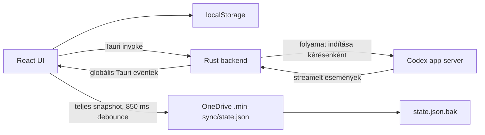
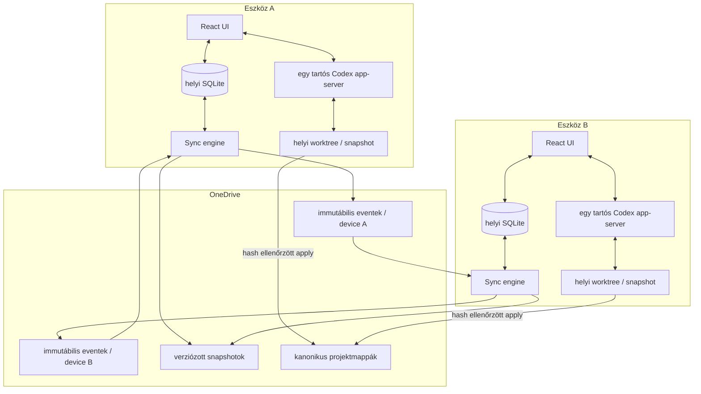

# `min` – biztonsági, szinkronizációs és megbízhatósági audit

**Dátum:** 2026-07-13  
**Állapot:** audit és implementációs terv – implementáció még nem történt  
**Elsődleges cél:** ugyanazokon a OneDrive-os projekteken és beszélgetéseken lehessen két Windows gépről dolgozni úgy, hogy egy hibás szinkron, offline gép, alkalmazásleállás vagy agentművelet ne okozhasson észrevétlen adatvesztést.

## 1. Vezetői összefoglaló

### Jelenlegi ítélet

A `min` jelenlegi állapotában **jó, működő UI-prototípus**, de **még nem tekinthető biztonságos elsődleges, kétgépes fejlesztői környezetnek**.

A legsúlyosabb okok:

1. A teljes közös állapot egyetlen, folyamatosan felülírt OneDrive-os `state.json` fájlban él. Ez klasszikus *last writer wins* működés: egy régi, offline gép új időbélyeggel felülírhatja a másik gépen közben létrejött beszélgetéseket.
2. A Codex jelenleg `approvalPolicy: "never"` és `workspace-write` módban dolgozik. Vagyis a kiválasztott projekt fájljait külön jóváhagyás nélkül módosíthatja vagy törölheti.
3. A helyi beszélgetési állapot elsődleges tárolója a böngészős `localStorage`; a tárolási hibák több helyen el vannak nyelve, majd az így hiányos állapot tovább is szinkronizálódhat.
4. Nincs valódi konfliktusfeloldás, törlési napló, visszaállítási központ, tartós verziózott mentés vagy kétgépes konvergenciateszt.
5. A projekt Git-metaadata ezen a gépen jelenleg nem működő OneDrive-reparse pointnak látszik, ezért a repositoryból nem érhető el használható Git-előzmény vagy rollback.
6. A Codex eseményei nincsenek szigorúan a kéréshez, turnhöz és beszélgetéshez kötve. Aktív futás közbeni projektváltásnál egy esemény vagy fájlolvasás rossz beszélgetésbe/projektbe kerülhet.

### Ami már jó alap

- A Tauri + React felépítés megfelelő ehhez a termékhez.
- A Codex `app-server` a helyes integrációs irány; hivatalosan támogat beszélgetés-előzményt, streamelt itemeket, megszakítást és jóváhagyási kéréseket.
- A jelenlegi projektmenüből végzett „Törlés” nem törli közvetlenül a fizikai projektmappát.
- A Rust-oldali fájlolvasás canonicalizálja az útvonalat, ellenőrzi, hogy a projekt gyökerén belül marad-e, és méretkorlátot alkalmaz.
- A most telepített npm-függőségekre az audit nem jelzett ismert sérülékenységet.
- A végső válasz elkülönített, keretezett megjelenítése jó termékirány.

### Kötelező sorrend

Az első kiadás előtt a prioritás:

1. adatvesztés megakadályozása;
2. projektfájlok visszaállíthatósága és agent-jóváhagyások;
3. kétgépes, ütközésbiztos szinkron;
4. pontos Codex-eseménymodell és élő munkamenet;
5. UI-polírozás és terjeszthető, aláírt alkalmazás.

Újabb látványfejlesztést a biztonsági alapok elé tenni nem indokolt.

---

## 2. Az audit hatóköre

Az audit a következőket vizsgálta:

- Tauri/Rust backend és a Codex `app-server` indítása;
- React állapotkezelés és helyi perzisztencia;
- OneDrive-os beszélgetésszinkron;
- projekt- és beszélgetéstörlés;
- Codex események, élő válasz, gondolkodási összefoglaló, parancs- és fájlműveletek;
- Markdown- és kódmegjelenítés;
- Tauri jogosultságok, CSP, binárisindítás és kiadási modell;
- npm/Rust függőségi állapot;
- a repository visszaállíthatósága.

Nem történt:

- forráskód-módosítás;
- adat- vagy projektmigráció;
- `state.json` javítása;
- Git-repository helyreállítása;
- biztonsági beállítások átállítása;
- tesztprojekt futtatása Codex-token felhasználásával.

---

## 3. Jelenlegi architektúra röviden



A fő probléma nem az, hogy OneDrive-ot használunk, hanem az, hogy a teljes közös állapotot egyetlen módosuló fájl hordozza, és annak aktuális tartalma egyben a törlési utasítás is. Ha valami hiányzik egy gép helyi memóriájából, a következő mentés a másik gépről is eltüntetheti.

---

## 4. Részletes megállapítások

### P0 – azonnal kezelendő, adatvesztést vagy projektkárosodást okozhat

| ID | Megállapítás | Következmény | Kódbeli bizonyíték |
|---|---|---|---|
| P0-01 | Egyetlen, felülírt `state.json` a közös igazságforrás | Offline vagy később induló gép teljes beszélgetéseket írhat felül | `src-tauri/src/codex.rs:490-525`, `src/App.tsx:1251-1272` |
| P0-02 | A konfliktusellenőrzés csak az `updatedAt` kliensórára épül | A régebbi tartalom új időbélyeggel frissebbnek látszik | `src-tauri/src/codex.rs:504-516` |
| P0-03 | Hibás/újabb schema vagy betöltési hiba után is íráskész lesz a kliens | Sérült vagy ismeretlen távoli állapotot egy üres/részleges helyi snapshot felülírhat | `src/App.tsx:1044-1065`, `1098`, `1159-1164` |
| P0-04 | Codex `approvalPolicy: never`, `sandbox: workspace-write` | Az agent külön engedély nélkül módosíthat vagy törölhet projektfájlokat | `src-tauri/src/codex.rs:295-302` |
| P0-05 | Nincs tartós rollback-pont vagy működő Git ezen a repositoryn | Hibás agentművelet vagy szinkron után nincs garantált visszaút | a workspace `.git` eleme üres OneDrive-reparse point; a Git-parancsok nem látnak repositoryt |
| P0-06 | Az élő események nincsenek beszélgetéshez/turnhöz route-olva | Projektváltáskor rossz chatbe kerülhet válasz, log vagy fájlbeolvasás | `src/App.tsx:1349-1385` |

#### P0-01/P0-02: miért veszélyes a mostani szinkron?

Példa:

1. A gép A hétfőn letölti a 10 beszélgetést tartalmazó állapotot, majd offline marad.
2. A gép B kedden létrehoz még 4 beszélgetést, és feltölti a 14 beszélgetéses fájlt.
3. A gép A szerdán elindul. Saját memóriájában még 10 beszélgetés van.
4. A frontend a teljes snapshotnak új, szerdai `updatedAt` értéket ad.
5. A gép A 10 beszélgetéses állapota „újabbnak” látszik, ezért felülírja a 14 beszélgetéses fájlt.

Ez nem elméleti edge case, hanem a jelenlegi modell természetes működése.

#### P0-03: hibánál fail-open működés

Szinkronbetöltési hiba, újabb schema vagy hibás fájl esetén az alkalmazásnak **csak olvasható karanténmódba** kellene lépnie. Jelenleg több útvonalon `syncReady = true` lesz, így az automatikus mentés elindulhat. Biztonsági szempontból ez fordított logika: ha nem bizonyítható, hogy a távoli állapot teljes és értelmezhető, tilos azt írni.

#### P0-04/P0-05: a projektmappa védelme

A UI projekt-törlése jelenleg csak a `min` saját metaadatait és chatjeit törli, nem a projektmappát. Ettől függetlenül maga a Codex agent `workspace-write` módban képes a fájlokat írni. A védelmet nem a promptnak kell biztosítania, hanem technikai korlátoknak:

- read-only alapmód;
- jóváhagyáskérés fájlmódosítás és veszélyes parancs előtt;
- lokális worktree/snapshot;
- hash-alapú ellenőrzés az eredeti OneDrive-projektbe történő alkalmazás előtt;
- automatikus rollback-pont.

### P1 – magas prioritás, megbízhatósági vagy biztonsági hiány

| ID | Megállapítás | Következmény | Kódbeli bizonyíték |
|---|---|---|---|
| P1-01 | `localStorage` az elsődleges chatadatbázis, a hibák el vannak nyelve | Kvóta, WebView-adattisztítás vagy sérülés után néma adatvesztés | `src/App.tsx:173-307`, `1104-1145` |
| P1-02 | Gyenge és változó entitásazonosítók | Rename, azonos cím vagy hashütközés duplikálhat/összekeverhet rekordokat | `src/App.tsx:127-161` |
| P1-03 | Nincs tombstone, archiválás vagy Recovery Center | A törlés gyorsan minden gépre propagálódik, korábbi állapot nélkül | `src/App.tsx:1455`, `1514` |
| P1-04 | A work log nyers kódot és parancskimenetet is szinkronizál | Titok, `.env`, privát forrás vagy nagy adatmennyiség kerülhet a közös state-be | `src/App.tsx:1375`, `1712-1719` |
| P1-05 | Élő event és a válaszban visszakapott event újrajátszása keveredik | Duplikált progressz, szöveg vagy inkonzisztens workflow | `src/App.tsx:1674-1680` |
| P1-06 | Kérésenként új `app-server` indul | Állapotvesztés, lassúság, nehéz megszakítás és event-routing | `src-tauri/src/codex.rs` process lifecycle |
| P1-07 | Nincs app-server timeout, watchdog és használható diagnosztikai stderr | Beragadt folyamat és nehezen visszakereshető hiba | `src-tauri/src/codex.rs:229`, `263` |
| P1-08 | A megszakítás process-tree kényszerleállításával történik | Nem szabályos turnlezárás, részleges állapot maradhat | Windows `taskkill /T /F` útvonal |
| P1-09 | CSP nincs beállítva; Tauri capability-k nincsenek explicit szűkítve | Egy későbbi XSS vagy új webview túl nagy backend-hozzáférést kaphat | `src-tauri/tauri.conf.json:24` |
| P1-10 | Tetszőleges Codex bináris indítható env/PATH alapján | Release-ben binárishelyettesítés vagy verziódrift lehetséges | `src-tauri/src/codex.rs:113-137` |

### P2 – fontos termékminőség és karbantarthatóság

| ID | Megállapítás | Következmény |
|---|---|---|
| P2-01 | A gondolkodási itemeket a kompakt workflow kiszűri | A felhasználó nem tudja eldönteni, hogy mit csinál élőben a Codex |
| P2-02 | Csak az utolsó 32/80 workflow elem marad látható | Hosszabb munkánál eltűnik az auditálható előzmény |
| P2-03 | Kézzel írt, részleges Markdown-renderer | Listák, címsorok, táblák és kódblokkok nem jelennek meg teljes értékűen |
| P2-04 | Linkprotokoll nincs szigorú allowlisthez kötve | Nem kívánt linktípus megnyitható |
| P2-05 | Egy nagyon nagy `App.tsx` és halmozódó CSS override-ok | UI-regressziók – például workflow igazítás – könnyen visszatérnek |
| P2-06 | Nincsenek automata tesztek és CI | Szinkron- és eventhibák csak manuálisan derülnek ki |
| P2-07 | README és néhány régi komponens/fájl elavult | A dokumentáció nem a tényleges viselkedést írja le |
| P2-08 | Meglévő projekt megnyitásakor rejtett AGENTS-másolás történhet | Az app felhasználói engedély nélkül módosíthat egy meglévő projektet |

---

## 5. Függőségi és platformbiztonsági állapot

### npm

2026-07-13-án:

- production audit: 0 ismert sérülékenység;
- teljes audit: 0 ismert sérülékenység;
- telepített Codex CLI: `@openai/codex 0.144.1`;
- Tauri API: `2.11.1`;
- Tauri CLI: `2.11.4`;
- React: `19.2.7`;
- TypeScript: `5.9.3`;
- Vite: `6.4.3`.

Vannak újabb major verziók, de ezek **nem azonosak sérülékenységgel**. Biztonsági alapozás közben tilos vakon nagy Vite/TypeScript upgrade-et végezni; külön kompatibilitási ágon, tesztekkel kell kezelni.

### Rust

A gépen nincs telepítve `cargo-audit`, ezért RustSec-alapú sérülékenységi audit nem készült. A `cargo tree -d` mutat verzióduplikációkat, de ebből nem lehet sérülékenységmentességet kijelenteni.

Kiadási kapu:

- `cargo audit`;
- `cargo deny check advisories bans licenses sources`;
- npm audit;
- lockfile-diff felülvizsgálat;
- SBOM generálás.

### Hivatalos platformkövetelmények

- A [Tauri CSP útmutatója](https://v2.tauri.app/security/csp/) alapján restriktív CSP-t kell beállítani; `csp: null` mellett ez a védelmi réteg nem működik.
- A [Tauri capability modellje](https://v2.tauri.app/security/capabilities/) alapján explicit ablak- és parancsjogosultságok szükségesek.
- A [Tauri terjesztési dokumentációja](https://v2.tauri.app/distribute/) alapján aláírt installer és reprodukálható release-folyamat kell.

---

## 6. OneDrive-specifikus kockázatok

### A törlés szinkronizálódik

A Microsoft dokumentációja szerint egy szinkronizált mappában helyileg törölt fájl törlése a felhőbe és a többi eszközre is továbbterjed. A OneDrive lomtár hasznos utolsó védőháló, de az alkalmazás adatbiztonsága nem épülhet rá: [Microsoft – synced file moved to recycle bin](https://learn.microsoft.com/en-us/troubleshoot/sharepoint/sync/synced-file-moved-to-recycle-bin).

### Files On-Demand

Placeholder vagy nem hidratált fájlok elérési hibát okozhatnak. A kontrolladatokat és az aktív projekteket ajánlott „Always keep on this device” állapotba tenni, de nem szükséges az egész OneDrive globális kikapcsolása: [Microsoft – Files On-Demand error 0x8007016a](https://learn.microsoft.com/en-us/troubleshoot/sharepoint/sync/copy-files-error-0x8007016a).

### SQLite-ot nem szabad közvetlenül OneDrive-ban megosztani

Az SQLite saját dokumentációja figyelmeztet, hogy hálózati/szinkronizált fájlrendszeren a lock- és konzisztenciatulajdonságok nem garantáltak: [SQLite – use over a network](https://www.sqlite.org/useovernet.html).

Ezért a célarchitektúrában:

- a SQLite adatbázis gépenként, `%LOCALAPPDATA%\min\min.db` alatt él;
- OneDrive-ban csak immutábilis, eszközönként külön írt eseményfájlok és verziózott snapshotok vannak;
- két gép soha nem írja ugyanazt a fájlt.

---

## 7. Kötelező biztonsági invariánsok

Az implementáció csak akkor tekinthető helyesnek, ha ezeket technikailag kikényszeríti:

1. **Sikertelen betöltés után nincs távoli írás.** Ismeretlen schema, parse error vagy Files On-Demand hiba csak olvasható karanténmódot vált ki.
2. **A hiány nem jelent törlést.** Egy snapshotból hiányzó rekord önmagában soha nem törölhet távoli adatot.
3. **Minden entitás stabil UUID/ULID azonosítót kap.** A cím, útvonal és kijelzett név nem identity.
4. **A törlés először archiválás/tombstone.** Tartós purge csak retention után, külön Recovery Centerből történhet.
5. **Egy eszköz csak a saját OneDrive-journalját írja.** Nincs közös, felülírt aktuális állapotfájl.
6. **Minden esemény idempotens.** Ugyanaz az event többször beolvasva sem duplikálhat adatot.
7. **Minden agent-turn előtt létezik rollback-pont.** Git worktree/commit vagy nem-Git snapshot nélkül nincs közvetlen fájlírás.
8. **A módosítás csak változatlan base-re alkalmazható.** Ha közben a másik gép megváltoztatta a fájlt, automatikus felülírás helyett 3-way merge/konfliktus kell.
9. **Minden Codex-eventet `requestId + threadId + turnId + itemId` route-ol.** Aktív UI-váltás nem változtathatja meg a célbeszélgetést.
10. **Nyers titok és teljes forráskód alapból nem szinkronizálódik.** Csak strukturált metaadat, diffösszefoglaló és korlátozott log.
11. **A végső válasz egyszer áll elő.** Az élő stream és a completion payload nem játszhatja újra ugyanazt a tartalmat.
12. **A helyreállítás rendszeresen tesztelt funkció.** A backup puszta létezése nem elég.

---

## 8. Javasolt célarchitektúra



### 8.1 Helyi adatbázis

Helye:

```text
%LOCALAPPDATA%\min\min.db
%LOCALAPPDATA%\min\backups\...
%LOCALAPPDATA%\min\logs\...
%LOCALAPPDATA%\min\workspaces\...
```

Minimum táblák:

- `devices` – stabil eszköz-ID, név, utolsó HLC;
- `projects` – stabil projekt-ID, kijelzett név, canonical path, local availability;
- `conversations` – stabil chat-ID, projekt-ID, cím, archive state;
- `messages` – stabil message-ID, role, body, HLC, origin device;
- `turns` – Codex-turn állapot, request/thread/turn azonosítók;
- `work_items` – reasoning summary, plan, command, file change, tool és status;
- `codex_thread_bindings` – gépenkénti thread-hozzárendelés;
- `sync_events` – lokálisan létrehozott és importált eventek;
- `sync_cursors` – mely eszköz melyik eventjéig jutott;
- `approvals` – parancs- és fájlmódosítási döntések auditja;
- `backups` – snapshotok, hash, retention és restore státusz.

SQLite beállítások:

- WAL mód helyi lemezen;
- foreign key enforcement;
- tranzakció minden user message + turn creation körül;
- verziózott, előre és vissza tesztelt migrációk;
- induláskori `integrity_check` időszakosan, nem minden rendernél;
- automatikus helyi snapshot rotáció.

### 8.2 OneDrive journal

Javasolt könyvtárszerkezet:

```text
<OneDrive>\my projects\.min-sync\v2\
  schema.json
  devices\
    <device-id>.json
  events\
    <device-id>\
      2026-07\
        <ulid>.json
  snapshots\
    <device-id>\
      <timestamp>-<hash>.json.zst
  quarantine\
  migration\
    v1-import-manifest.json
```

Egy event egy új fájl. A létrehozó gép később sem módosítja. A másik gép csak olvassa. Az atomi megjelenést ideiglenes fájl + ugyanazon könyvtáron belüli rename biztosítja; a végleges fájl tartalmazza saját SHA-256 hashét vagy aláírt envelope-ját.

Példa eseménytípusok:

- `project.added`;
- `project.renamed`;
- `project.sidebar_removed` – lokális preferencia, nem közös törlés;
- `conversation.created`;
- `conversation.renamed`;
- `conversation.archived`;
- `conversation.restored`;
- `message.created`;
- `turn.started` / `turn.completed` / `turn.failed`;
- `codex.binding.updated`;
- `purge.requested` / `purge.committed`.

Minden event tartalmazza:

- `schemaVersion`;
- `eventId` ULID;
- `deviceId`;
- `entityId`;
- `eventType`;
- hybrid logical clock;
- eszközön belüli monoton sequence;
- payload;
- előző eszközevent hashét;
- payload hashét.

Az eszközönkénti hash-lánc nem teljes kriptográfiai identitásrendszer, de felismeri a hiányzó, módosított vagy visszatekert journalt.

### 8.3 Konfliktuspolitika

| Művelet | Szabály |
|---|---|
| Új üzenet két gépen | Halmazegyesítés stabil message ID alapján; HLC szerinti megjelenítés |
| Beszélgetés átnevezése két gépen | Determinisztikus LWW HLC/device tiebreakkel; korábbi cím alias/history marad |
| Beszélgetés törlése vs. új üzenet | Archivált marad, de az új üzenet nem vész el; Recovery Center jelzi a konfliktust |
| Projekt eltávolítása oldalsávból | Géphelyi preferencia, másik gépet nem érinti |
| Projekt archiválása | Közös tombstone, fizikai mappát nem töröl |
| Ismeretlen schema | Karantén, nincs automatikus downgrade és nincs írás |
| Duplikált event | Idempotensen ignorálva |
| Hiányzó event sequence | Sync warning; a cursor nem ugrik át rajta csendben |
| Óraeltérés | HLC + sequence; a falióra önmagában nem dönt konfliktust |

### 8.4 Snapshotok és tömörítés

Az event journal növekszik, ezért kell snapshot, de a snapshot **nem helyettesíti** a journalt:

- snapshot csak egy igazolt event-prefixből készül;
- fájlneve immutábilis és hash-elt;
- legalább több generáció marad meg;
- restore után a snapshot óta érkezett eventek újrajátszhatók;
- másik gép snapshotját egy gép soha nem írja felül;
- a compaction csak akkor törölhet régi eventet, ha mindkét eszköz acknowledgementje és külön backupja megvan;
- az első stabil verzióban compaction nélküli működés biztonságosabb.

---

## 9. Projektfájlok biztonságos szerkesztése

### 9.1 Három végrehajtási mód

1. **Elemzés – read-only**  
   A Codex olvashat, kereshet és tervet készíthet, de fájlt/parancsot nem módosíthat. Ez legyen az alapmód az átmeneti biztonsági fázisban.

2. **Védett írás – alapértelmezett végleges mód**  
   A Codex helyi worktree-ban vagy snapshotmásolatban dolgozik. A változás diffként jelenik meg, és csak ellenőrzött apply után kerül a OneDrive-os projektbe.

3. **Közvetlen írás – haladó mód**  
   Csak kifejezett, jól látható opt-in. Előtte automatikus rollback-pont; veszélyes parancsokra továbbra is jóváhagyás.

### 9.2 Git-projektek

- A projekt OneDrive-os canonical mappáját nem a Codex módosítja közvetlenül.
- A helyi `%LOCALAPPDATA%\min\workspaces` alatt külön Git worktree készül.
- Turn elején rögzül a base commit és a working tree hashmanifest.
- A Codex ott dolgozik és tesztel.
- Apply előtt a canonical projekt újraellenőrzése történik.
- Ha a base megváltozott, rebase/3-way merge vagy felhasználói konfliktusfeloldás szükséges.
- Sikeres apply után diff, commit/opcionális checkpoint és auditbejegyzés készül.

### 9.3 Nem-Git projektek

- Turn elején fájlmanifest készül: relatív path, méret, mtime csak tájékoztatóként, SHA-256 döntési alapként.
- A módosítandó fájlokról tartalmi snapshot készül helyi backupba.
- A Codex másolaton dolgozik.
- Apply előtt minden érintett base hash újraellenőrződik.
- Eltérésnél nincs felülírás; 3-way merge vagy külön konfliktusmásolat készül.
- Törlés először helyi trash/backup állapot, nem közvetlen végleges delete.

### 9.4 Codex-jóváhagyások

A [Codex App Server hivatalos dokumentációja](https://learn.chatgpt.com/docs/app-server) támogat szerver által indított parancs- és fájlmódosítási jóváhagyási kéréseket, valamint szabályos `turn/interrupt` műveletet.

A UI-ban külön kezelendő:

- `item/commandExecution/requestApproval`;
- `item/fileChange/requestApproval`;
- döntések: egyszeri engedély, sessionre engedély, elutasítás, megszakítás;
- veszélyességi besorolás és pontos cwd/parancs/diff;
- session-engedély csak szűk, értelmezhető parancsprefixre;
- destructive commandra nincs globális „mindig engedélyezem”.

### 9.5 A repository jelenlegi Git-problémája

A következő implementációs munka előtt külön Phase 0 feladat:

- a `.git` reparse point állapotának dokumentált mentése;
- annak eldöntése, hogy Files On-Demand hidratálási hiba, sérült junction vagy elveszett repository-metaadat történt;
- a repository helyreállítása megbízható forrásból;
- vagy új Git-repository inicializálása csak akkor, ha bizonyítottan nincs megőrzendő korábbi history;
- OneDrive-tól független remote backup létrehozása.

Ezt automatikusan és találgatva javítani tilos.

---

## 10. Codex app-server és élő munkamenet

### 10.1 Tartós backendkapcsolat

A jelenlegi kérésenkénti processindítás helyett egy felügyelt, tartós `app-server` kapcsolat kell:

- pontosan egy `initialize` connectionönként;
- JSON-RPC multiplexer a response, notification és server request üzenetekhez;
- request registry timeouttal és garantált cleanup-pal;
- automatikus újraindítás crash esetén;
- kontrollált stderr ring buffer titokszűréssel;
- pinned Codex-verzió és abból generált schema;
- stabil API-k használata, `experimentalApi` csak valóban szükséges feature-re;
- szabályos `turn/interrupt`, process kill csak timeoutos fallbackként.

### 10.2 Eseményazonosítás

Minden backendből érkező esemény normalizált envelope-ban érkezzen:

```text
requestId
conversationId
projectId
threadId
turnId
itemId
eventType
sequence
payload
receivedAt
```

A backend írja tranzakciósan a helyi adatbázisba, és csak ezután értesítse a UI-t. A React ne legyen az események tartós igazságforrása.

### 10.3 Mit mutasson élőben a felület?

A Codex App Server külön deltaeseményeket biztosít többek között:

- agent message;
- plan;
- reasoning summary text;
- reasoning summary section;
- command output;
- file change és diff.

Javasolt UI-rétegek:

#### A. Élő kommentár

Az `item/agentMessage/delta` rövid, kisebb betűs, kompakt szövegként jelenjen meg. Ez a „mit csinálok most” réteg.

#### B. Gondolkodási összefoglaló

Az `item/reasoning/summaryTextDelta` és `summaryPartAdded` külön, alapból összecsukott „Gondolkodás” elemben jelenjen meg. Ez olvasható reasoning-summary, nem szabad azt ígérni, hogy minden belső chain-of-thought látható.

#### C. Munkafolyamat

Az ikonlánc kizárólag állapotgépet mutasson:

- parancs indul/fut/kész/hiba;
- fájlmódosítás indul/kész/ütközés;
- tool hívás;
- approvalra vár;
- megszakítás;
- turn kész.

A thinking ikon elhagyható, mert önmagában kevés információt ad. Az ikon részlete floating popoverben vagy modalban nyíljon meg, ne tolja szét a chatet.

#### D. Terv

Ha van plan item/delta, külön kompakt, frissülő tervként jelenjen meg. A kész lépések állapota változzon, ne új szövegsorokkal duplikálódjon.

#### E. Végső válasz

Csak a befejezett végső agent message kerüljön a nagy, keretezett blokkba. A végső blokk nem az élő kommentárok concatenációja, és nem szabad a completionkor ugyanazt az eventstreamet újrajátszani.

### 10.4 Navigáció futó turn közben

Két elfogadható megoldás van:

- teljes, helyes event-routing mellett szabad projektváltás; vagy
- az első biztonságos verzióban a futó turn beszélgetése vizuálisan „fut”, a váltás megengedett, de a háttérturn minden eventje a saját conversation ID-jába íródik.

Az aktív UI-state-re támaszkodó globális listener nem maradhat.

### 10.5 Hosszú logok és sok fájl

- A teljes eseménylista adatbázisban maradjon; a UI virtualizálja.
- Ne legyen néma `slice(-32)`/`slice(-80)` adatvesztés.
- A kódtartalom ne kerüljön automatikusan a chat snapshotba.
- A workflow fájlitemje a pathot, változástípust, sorstatisztikát és diff-hivatkozást tárolja.
- Nagy diff külön, virtuálisan renderelt nézetben nyíljon meg.
- Több ezer soros fájlt alapból ne rendereljen a chat; csak releváns diffhunkokat.

---

## 11. Chat- és Markdown-megjelenítés

### Végső válasz

- teljes CommonMark/GFM renderer;
- HTML alapból tiltva vagy erősen sanitizálva;
- linkprotokoll allowlist: `https`, szükség esetén ellenőrzött lokális file-open command;
- `noopener noreferrer` külső linknél;
- listák, táblák, címsorok, blockquote és task list;
- fenced code block nyelvjelöléssel, copy gombbal, összecsukással;
- nagyon hosszú kód virtualizálva;
- biztonságos helyi fájllinkek csak backend-authorizációval.

### Élő szöveg

- külön tipográfiai tokenek a progresszhez és a final answerhez;
- fix, tesztelt line-height a kisebb betűmérethez;
- ne `justify`, ha ettől zavaró szóközök keletkeznek; rövid technikai kommentárhoz a compact left align olvashatóbb;
- egy turn progresszrésze és final blokkja között konzisztens vertikális ritmus.

### UI-struktúra

A `src/App.tsx` bontandó legalább ezekre:

- conversation controller;
- sync state adapter;
- Codex turn controller;
- message list;
- live commentary;
- reasoning summary;
- workflow strip;
- final answer renderer;
- project tree;
- settings;
- approval dialog;
- recovery center.

A CSS design tokenokra és komponensenkénti stílusokra váljon szét. A jelenlegi egymásra rakódott override-ok miatt egyszerű Y-offset változtatás is regressziót okozhat.

---

## 12. Tauri- és alkalmazásbiztonság

### Kötelező hardening

- restriktív CSP;
- explicit Tauri capabilities csak a fő ablaknak;
- typed Rust commandok `serde` structokkal, nem tetszőleges `serde_json::Value`;
- maximális payloadméret minden commandra;
- schema- és tartományvalidáció;
- canonical project registry: a frontend csak opaque project ID-t küld, nem szabadon választott útvonalat;
- minden írásnál újracanonicalizálás és root-ellenőrzés;
- symlink/reparse point policy;
- érzékeny fájlok denylistje (`.env`, credential store, `.git` internals, kulcsfájlok), külön explicit override nélkül;
- release buildben nincs `MIN_CODEX_BIN` és nincs PATH fallback;
- csomagolt, pinned Codex sidecar hash- és verzióellenőrzéssel;
- signed Windows installer és update-csatorna;
- diagnosztikai log titokredakcióval és méretrotációval.

### AGENTS.md kezelés

Új projekt létrehozásakor felajánlható a sablon. Meglévő projekt hozzáadásakor:

- automatikus, rejtett másolás ne történjen;
- előnézet mutassa, mit írna;
- „Ne módosítsd a projektet” legyen az alap;
- a global és project-local instrukcióréteg legyen látható a beállításokban.

---

## 13. Törlés, archiválás és Recovery Center

### Terminológia

- **Eltávolítás az oldalsávból:** csak az adott gép UI-beállítása.
- **Beszélgetés archiválása:** közös, visszafordítható állapot.
- **Projekt archiválása a minből:** a projektmappa érintetlen.
- **Fizikai projekt törlése:** az első stabil kiadásban ne legyen támogatott.
- **Végleges purge:** csak saját appadatokra, retention és több megerősítés után.

### Recovery Center

Mutassa:

- archivált beszélgetések és projekthivatkozások;
- törlés időpontja és eredeti eszköze;
- konfliktusok;
- karanténba tett hibás sync eventek;
- elérhető helyi és OneDrive snapshotok;
- egy kattintásos előnézet, de nem egy kattintásos végleges törlés;
- restore dry run és várható hatás;
- restore utáni integrity check.

Javasolt retention:

- helyi gyors snapshot: utolsó 30 nap, sűrű rotáció;
- napi snapshot: 90 nap;
- havi snapshot: 12 hónap;
- purge csak akkor, ha legalább egy külön eszköz vagy külső backup igazoltan tartalmazza az adatot.

---

## 14. Migráció a jelenlegi v1 `state.json` modellből

### Alapelv

A migráció **copy-only**, nem in-place átalakítás.

### Folyamat

1. Mindkét ismert v1 állapotfájl read-only leltározása.
2. SHA-256 és bytepontos backup külön, időbélyeges könyvtárba.
3. A jelenlegi globális és a legacy app-local state összehasonlítása.
4. Projektek, beszélgetések, üzenetek és work itemek importja stabil új ID-kkel.
5. Minden forrásrekordhoz import provenance.
6. Duplikáció gyanúját automatikus törlés helyett review listára tenni.
7. Új SQLite integritás- és darabszámellenőrzése.
8. Első v2 journal és snapshot létrehozása.
9. A v1 fájlok átnevezés nélkül, read-only legacy backupként megmaradnak.
10. Legalább két stabil kiadásig legyen v1 export/restore eszköz.

### Jelenlegi adatállapot

Az audit időpontjában a fő OneDrive state két projektet, két beszélgetést, 34 üzenetet és 36 work itemet tartalmazott. A `.bak` csak néhány perccel volt régebbi és lényegében ugyanazt az állapotot hordozta, ezért nem tekinthető valódi történeti mentésnek. Egy app-local legacy state ennél jóval kevesebb adatot tartalmaz; a csendes fallback ezt tévesen újra elsődlegessé teheti.

A konkrét darabszám csak migráció előtti diagnosztikai adat, az implementáció megkezdésekor újra mérendő.

---

## 15. Implementációs roadmap

### Phase 0 – biztonsági befagyasztás és baseline

**Cél:** ne történhessen további észrevétlen adatvesztés a refaktor alatt.

Feladatok:

- jelenlegi state és backupok bytepontos, hash-elt mentése;
- repository Git/reparse point diagnózis és külön döntési jegyzőkönyv;
- OneDrive-tól független forrásbackup/remote;
- automatikus sync-save ideiglenes fail-closed guardja a későbbi implementáció első commitjában;
- „sync health” diagnosztikai képernyő;
- jelenlegi schema és rekorddarabszám baseline;
- minimális reprodukciós tesztek a last-writer adatvesztésre;
- cargo-audit/cargo-deny telepítése és első riport.

Elfogadási feltétel:

- minden jelenlegi chat és state legalább két, OneDrive-tól független példányban megvan;
- hibás state betöltésével a program bizonyítottan nem ír távolra;
- Git helyreállításról explicit döntés született.

### Phase 1 – typed local store és stabil identity

**Cél:** a `localStorage` ne legyen adatbázis.

Feladatok:

- Rust domain model és SQLite schema;
- UUID/ULID minden projekthez, beszélgetéshez, üzenethez, turnhöz és itemhez;
- transactional message/turn persistence;
- schema migrations;
- helyi snapshotrotáció;
- localStorage csak UI-preferenciákra;
- startup integrity és read-only recovery mode;
- typed Tauri commandok.

Elfogadási feltétel:

- WebView/localStorage törlése után sem vesznek el beszélgetések;
- process-kill minden írási ponton vagy teljes tranzakciót, vagy semmit hagy;
- rename nem változtat entity ID-t.

### Phase 2 – append-only OneDrive Sync v2

**Cél:** két offline/online gép adatvesztés nélkül konvergáljon.

Feladatok:

- eszközönkénti journal writer;
- event validator és hash-chain;
- incremental importer/cursor;
- HLC és device sequence;
- konfliktuspolitika;
- karantén;
- immutable snapshot;
- v1 copy-only migrátor;
- sync status és részletes, emberi nyelvű hibaállapot.

Elfogadási feltétel:

- 1000+ generált kétgépes interleaving ugyanarra az állapothashre konvergál;
- offline gép visszatérése nem törölhet új rekordot;
- ismeretlen schema mellett nincs egyetlen remote write sem;
- félbeszakított OneDrive-írás nem hoz létre elfogadott részleges eventet.

### Phase 3 – archiválás, tombstone, Recovery Center

**Cél:** minden normál törlés visszafordítható legyen.

Feladatok:

- sidebar remove és shared archive különválasztása;
- tombstone eventek;
- retention;
- Recovery Center;
- restore dry run;
- snapshot restore;
- delete/restore audit trail.

Elfogadási feltétel:

- beszélgetés 30 napon belül teljes work loggal visszaállítható;
- projekt oldalsávból eltávolítása semmilyen fájlt vagy másik gépes állapotot nem töröl;
- fizikai projektmappa-törlés nincs elérhető közönséges menüből.

### Phase 4 – védett agent-végrehajtás

**Cél:** a Codex ne tudja visszaállíthatatlanul károsítani a OneDrive-projektet.

Feladatok:

- read-only alapmód;
- app-server approval request kezelés;
- Git worktree és non-Git snapshot provider;
- base hash manifest;
- diff review;
- transactional apply;
- 3-way merge konfliktus;
- rollback;
- command policy és veszélyességi osztályozás.

Elfogadási feltétel:

- szándékosan destruktív tesztturn után a canonical projekt bytepontosan visszaállítható;
- másik gépen közben módosított fájlt a rendszer soha nem ír felül csendben;
- jóváhagyásra váró parancs nem indul el UI-döntés nélkül.

### Phase 5 – tartós app-server és pontos live event modell

**Cél:** a felhasználó élőben, érthetően és hibamentesen lássa a Codex munkáját.

Feladatok:

- persistent process supervisor;
- JSON-RPC multiplexer;
- request/thread/turn/item routing;
- szabályos interrupt;
- reasoning summary, plan, command és file-change state machine;
- adatbázisba írt teljes work log;
- live/final tartalom szétválasztása;
- navigáció futó turn közben;
- hosszú log virtualizálása.

Elfogadási feltétel:

- nincs duplikált delta vagy final answer;
- projektváltás alatt 100%-ban a helyes beszélgetésbe kerül minden event;
- app restart után a folyamatnapló teljes és sorrendhelyes;
- cancel először `turn/interrupt`, és csak timeout után process kill.

### Phase 6 – chat UI és kódnézet minőségi kiadás

**Cél:** kompakt, stabil, Codex-minőségű olvashatóság.

Feladatok:

- biztonságos GFM renderer;
- final answer komponens;
- live commentary és reasoning summary;
- egy soros, reszponzív workflow strip;
- virtualizált diff/kódnézet;
- accessibility és keyboard navigation;
- komponens- és screenshot regression tesztek;
- `App.tsx` és CSS moduláris bontása;
- legacy komponensek/fájlok eltávolítása csak használati bizonyíték után.

Elfogadási feltétel:

- 10, 50 és 200 workflow itemnél nincs slider vagy layout overflow;
- kis- és nagy DPI-n az ikonok baseline-ja egyezik;
- több ezer soros kód nem fagyasztja le a chatet;
- final answer listái, táblái és kódblokkjai helyesen renderelődnek.

### Phase 7 – hardening és kiadás

**Cél:** telepíthető, reprodukálható és auditálható Windows app.

Feladatok:

- CSP és capabilities;
- pinned/bundled Codex sidecar;
- release env/PATH override tiltása;
- signed installer;
- update- és rollback-stratégia;
- dependency gates és SBOM;
- privacy/redaction review;
- telemetry csak explicit opt-innel;
- backup/restore runbook.

Elfogadási feltétel:

- nincs high/critical npm vagy Rust advisory;
- release csak aláírt artifactból telepíthető;
- sidecar hash/version eltérésnél az app nem indul írható módban;
- security checklist CI-kapu.

### Phase 8 – kétgépes release qualification

**Cél:** valós használatban bizonyítani a fő ígéretet.

Tesztmátrix:

- A és B gép felváltva online;
- mindkettő offline módosít, majd eltérő sorrendben csatlakozik;
- OneDrive sync pause/resume;
- app kill írás közben;
- Windows reboot Codex-turn közben;
- Files On-Demand placeholder;
- hibás event, hiányzó sequence és ismeretlen schema;
- párhuzamos chat rename/archive/restore;
- párhuzamos projektfájl-módosítás;
- Codex crash és újraindulás;
- teljes adatbázis-restore új gépre.

Kiadási feltétel:

- legalább 7 napos kétgépes soak test adatvesztés nélkül;
- minden adat ugyanarra a logikai state hashre konvergál;
- végrehajtott és dokumentált restore drill;
- egyetlen silent overwrite sem fordul elő;
- minden konfliktus látható és visszaállítható.

---

## 16. Tesztstratégia

### Unit tesztek

- event schema és hash;
- HLC ordering;
- idempotens import;
- rename/archive/restore reducer;
- path authorization;
- approval policy;
- Markdown sanitization;
- work-item state machine.

### Property-based tesztek

Véletlen eventinterleaving két vagy több eszközre:

- minden sorrend ugyanarra a state-re konvergáljon;
- duplikáció ne változtassa az eredményt;
- eseménykihagyás észlelhető legyen;
- timestamp-visszaállítás ne okozzon adatvesztést;
- archive + message konfliktus megőrizze az üzenetet.

### Fault injection

- process kill temp write előtt/közben/után;
- 0 byte-os, félbevágott vagy hibás hashű event;
- read-only OneDrive;
- elérhetetlen placeholder;
- disk full;
- SQLite busy/corrupt;
- app-server válaszidőtúllépés;
- duplikált és sorrenden kívüli Codex delta.

### E2E

- két külön `%LOCALAPPDATA%` profilt szimuláló device A/B;
- valódi, ideiglenes szinkronkönyvtár;
- chat létrehozás mindkét oldalon;
- Codex nélküli fake app-server fixture a determinisztikus live UI-tesztekhez;
- csak egy kis, külön token-budgetelt smoke teszt használjon valódi Codexet, Luna Low módban.

### UI regression

- workflow 1/8/20/100/200 itemmel;
- hosszú parancs és hosszú filepath;
- több fájlmódosítás;
- approval popover;
- reasoning summary nyitva/zárva;
- 100%, 125%, 150% Windows scaling;
- keskeny és ultrawide ablak.

---

## 17. Megfigyelhetőség és diagnosztika

A felhasználó számára látható Sync Health:

- helyi DB állapot;
- OneDrive root és elérhetőség;
- Files On-Demand státusz;
- utolsó feltöltött és importált event;
- eszközönkénti cursor;
- függő konfliktusok;
- karanténolt eventek;
- utolsó sikeres snapshot és restore-próba;
- Codex app-server státusz és verzió;
- aktív turnök.

Logolás:

- strukturált JSON log helyben;
- path- és secretredukció;
- parancskimenet alapból korlátozott;
- rotáció és méretlimit;
- support bundle csak explicit exporttal;
- support bundle előnézet export előtt.

SLO-javaslat:

- lokális üzenet RPO: 0 sikeres UI-submit után;
- remote sync: eventual, normál OneDrive mellett néhány percen belül;
- helyi backupból RTO: 5 perc alatt;
- másik gépes teljes visszaállítás: 30 perc alatt;
- silent data loss: 0 megengedett eset.

---

## 18. Amit kifejezetten nem szabad megvalósítani

- Egyetlen SQLite fájl közvetlen megosztása OneDrive-on.
- A jelenlegi single `state.json` megtartása újabb timestamp-trükkel.
- Kliensfalióra használata egyetlen konfliktusdöntőként.
- Hiányzó rekord automatikus törlésként értelmezése.
- Agent közvetlen írása rollback és base-hash ellenőrzés nélkül.
- Automatikus „mindent engedélyezek” destructive parancsokra.
- Nyers teljes forrásfájlok és `.env` tartalom szinkronizálása a work logban.
- Sérült vagy ismeretlen sync schema automatikus felülírása.
- V1 állapot törlése a migráció első sikeresnek tűnő futása után.
- UI-polírozás a P0/P1 adatvédelmi munka helyett.
- Nagy dependency-major upgrade és architektúraváltás összekeverése ugyanabban a release-ben.

---

## 19. Első implementációs csomag javasolt határa

Amikor az implementáció elkezdődhet, az első csomag kizárólag ezt tartalmazza:

1. state és repository biztonsági mentési runbook;
2. Git/reparse point diagnózis lezárása;
3. szinkron fail-closed guard;
4. SQLite domain skeleton és stabil ID-k;
5. v1 read-only importteszt;
6. kétgépes szinkron reprodukciós tesztharness;
7. Codex read-only alapmód vagy approval-kapu;
8. cargo/npm audit CI.

Nem tartozik az első csomagba:

- új workflow dizájn;
- Markdown renderer csere;
- nagy CSS-refaktor;
- automatikus update;
- dependency major upgrade.

Ez a határ biztosítja, hogy az első változtatások már csökkentsék, ne növeljék a veszélyt.

---

## 20. Végső ajánlás

A projektet érdemes folytatni: a választott Tauri/React/Codex app-server alap megfelelő, és a kívánt kompakt, élő Codex-szerű kliens technikailag reális.

Viszont a `min` addig ne legyen az egyetlen elsődleges munkafelület és ne kapjon védtelen írási jogot fontos projektekhez, amíg legalább a Phase 0–4 nem teljesül. A legfontosabb architekturális döntés:

> **Helyi, tranzakciós adatbázis gépenként + OneDrive-os, append-only eszközjournal + védett helyi worktree/snapshot + hash-ellenőrzött apply.**

Ez oldja meg egyszerre a kétgépes beszélgetésszinkront, a visszaállíthatóságot, az offline konfliktusokat és az agent által okozható projektkárok jelentős részét. Erre már biztonságosan ráépíthető a pontos live reasoning summary, a szép workflow és a kiforrott final-answer UI.

